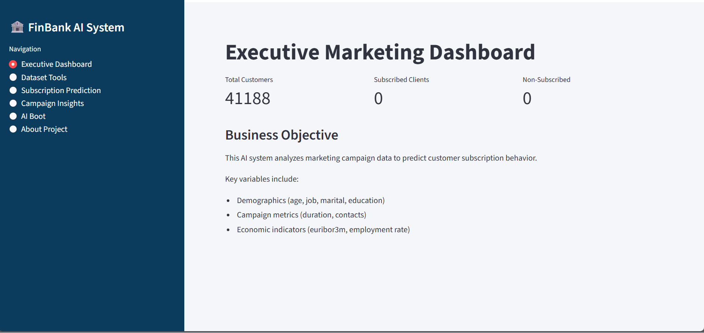
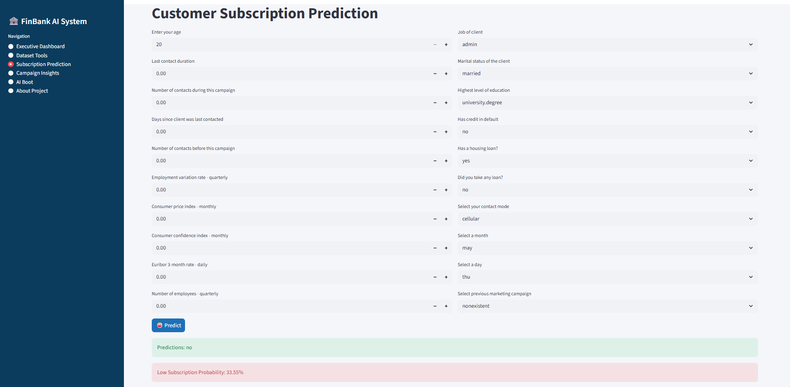

# Bank-AI-Marketing-Intelligence-System

## Project Overview
FinBank AI Marketing Intelligence System is a Machine Learning-powered web application designed to predict customer subscription to term deposits using real-world banking marketing data.
The system provides:
- Executive-level analytics dashboard
- Real-time subscription prediction
- Campaign performance insights
- Interactive dataset exploration
- AI-powered assistant for business queries
This project simulates a real-world banking analytics pipeline used by marketing and strategy teams.

## Machine Learning Model
- Algorithm Used: CatBoost Classifier
- Problem Type: Binary Classification
- Prediction Output: Subscription Probability
- Explainability: Feature Importance Analysis
CatBoost was selected due to its strong performance with categorical features and minimal preprocessing requirements.

## Application Features
- 🔐 Authentication System: Role-based login for secure access.
- Executive Dashboard
- Dataset Tools
- Subscription Prediction
- Campaign Insights
- AI Assistant

## Business Impact
This system can help banks:
- Improve marketing targeting precision
- Increase term deposit conversion rate
- Reduce unnecessary campaign costs
- Enhance customer segmentation
- Support strategic planning decisions

## Application Preview

- This project is developed for educational and demonstration purposes only.
- It does not represent financial advice or real banking systems.
